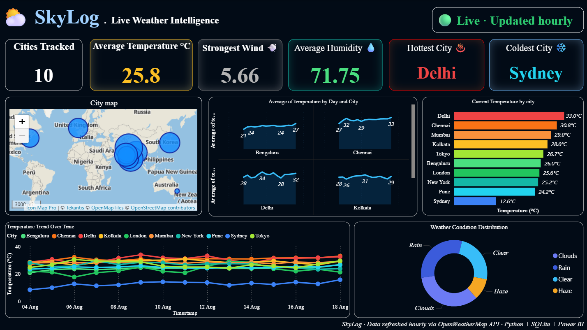

# SkyLog — Live Weather Intelligence Dashboard 🌤️


An end-to-end live data pipeline: a Python script pulls current weather
for 10 cities from the OpenWeatherMap API, logs each reading to a SQLite
database, and Power BI visualizes the growing historical dataset —
current conditions, temperature trends, hot/cold comparisons, weather
condition breakdown, and a color-coded city map. A GitHub Actions
workflow runs the pull automatically every hour, so the dataset keeps
growing with zero manual intervention on the data-collection side.



## 🔑 Key Metrics

| Metric              | Value                                                              |
|----------------------|-----------------------------------------------------------------------|
| Cities tracked         | 10 (Mumbai, Delhi, Bangalore, Chennai, Kolkata, Pune, New York, London, Tokyo, Sydney) |
| Refresh interval        | Hourly, via GitHub Actions                                           |
| Data source              | OpenWeatherMap Current Weather API                                   |
| Database                  | SQLite (`weather_data.db`), committed back to the repo each run      |
| Fields per reading        | temperature, feels-like, humidity, wind speed, condition, description, lat/lon, timestamp |

## 📌 Dashboard Features

- **KPI Strip** — Cities tracked, average temperature, average humidity, and strongest current wind at a glance across the top.
- **Hottest / Coldest City Cards** — Instantly surfaces the current temperature extremes across all 10 tracked cities.
- **Current Temperature by City (Bar Chart)** — All cities ranked and color-graded from red (hottest) to blue (coldest).
- **Temperature Trend Over Time (Line Chart)** — Every city plotted on one combined chart, color-coded, showing how conditions shift day to day.
- **Weather Condition Distribution (Donut Chart)** — Share of tracked cities currently experiencing Clear, Clouds, Rain, or Haze conditions.
- **City Map** — Bubble map (Icon Map Pro) plotting all 10 cities by exact lat/long, bubble size and color scaled to current temperature.

## 🛠️ Tools & Tech Stack

- **Python** — `requests` for the OpenWeatherMap API, `sqlite3` for storage, `python-dotenv` for local secrets
- **GitHub Actions** — Scheduled hourly workflow that runs the pull script and commits the updated database
- **SQLite** — Lightweight append-only log of every hourly reading per city
- **Power BI Desktop** — Data modeling, DAX measures, and dashboard design
- **DAX** — Calculated measures (Latest Temperature, Strongest Wind City/Speed, latest-row filtering for accurate counts)
- **Icon Map Pro** — Custom visual for the lat/long bubble map (classic Map/Filled Map visuals are disabled on many tenants)

## 📂 Repository Structure

```
skylog/
├── .github/
│   └── workflows/
│       └── weather-pull.yml   # hourly GitHub Actions job
├── dashboard/                 # Power BI (.pbix) file
├── images/                    # dashboard screenshots
├── weather_pull.py            # main data-pull script
├── weather_scheduler.py       # optional local loop (demo/manual use)
├── weather_data.db            # SQLite database (committed by the Action)
├── requirements.txt
└── README.md
```

## 🚀 How to Use

1. Clone this repository
   ```bash
   git clone https://github.com/AtharvaVSawant/skylog.git
   ```
2. Create a virtual environment and install dependencies:
   ```bash
   pip install -r requirements.txt
   ```
3. Copy `.env.example` to `.env` and add your own OpenWeatherMap API key
   (for running the script locally).
4. To run the GitHub Actions workflow in your own fork, add your key as a
   repository secret: **Settings → Secrets and variables → Actions → New
   repository secret** → name it `OPENWEATHER_API_KEY`.
5. Open the `.pbix` file inside the `dashboard/` folder using **Power BI
   Desktop**.
6. To pick up fresh data later: `git pull`, then click **Refresh** in
   Power BI Desktop.

## 📈 Insights & Takeaways

- **Delhi and Chennai consistently top the temperature chart**, running 15–20°C hotter than Sydney and London on most days tracked — a clear north/south, hemisphere-driven split across the city list.
- **Sydney stands out as the persistent cold outlier** on the combined trend chart, sitting well below the rest of the cluster across the full tracked period.
- **Clouds and Rain make up roughly half of all current conditions** across the 10 cities, with Clear and Haze splitting the remainder — a reasonably balanced mix for the current sample.
- The **live pipeline (GitHub Actions → SQLite → Power BI)** demonstrates a full automated ETL loop without needing a paid cloud database, useful as a lightweight pattern for other small-scale live dashboards.

## 🚧 What I'd Improve Next

- Move from SQLite to a hosted database (e.g. Postgres) so Power BI Service could refresh on a schedule directly, without needing a local file or gateway.
- Add a forecast table (5-day forecast endpoint) alongside current conditions, for a "predicted vs. actual" visual.
- Publish to Power BI Service with a real scheduled refresh once the data source is cloud-hosted.
- Add basic alerting (e.g. flag extreme temperature swings) using a simple threshold check in the Python script.

## 📄 License

This project is open-sourced under the [MIT License](LICENSE).

## 🙋 Author

Built by Atharva Sawant — feel free to connect or raise an issue for suggestions!
